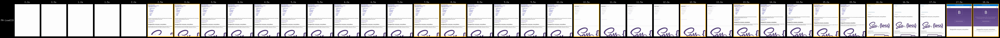
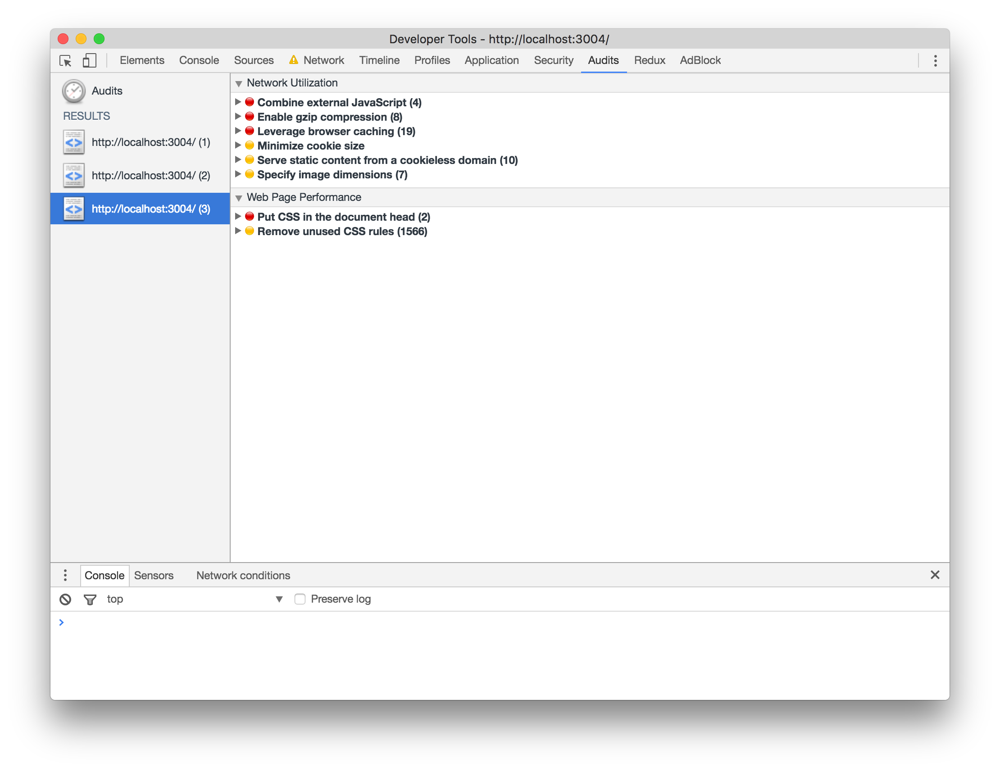
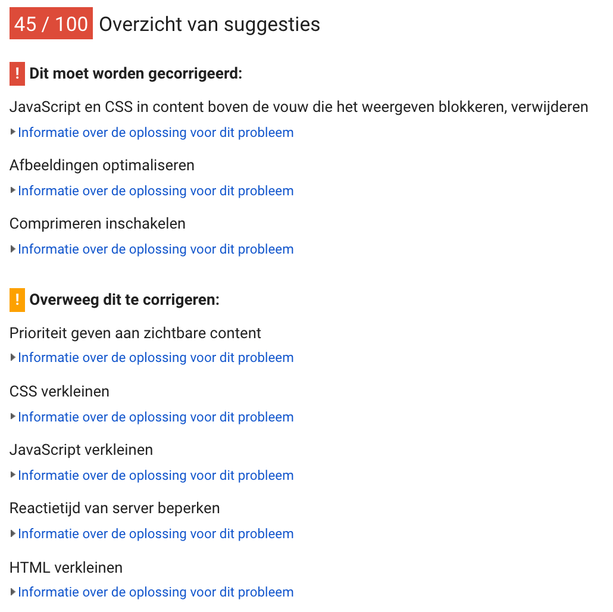
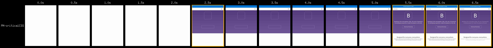
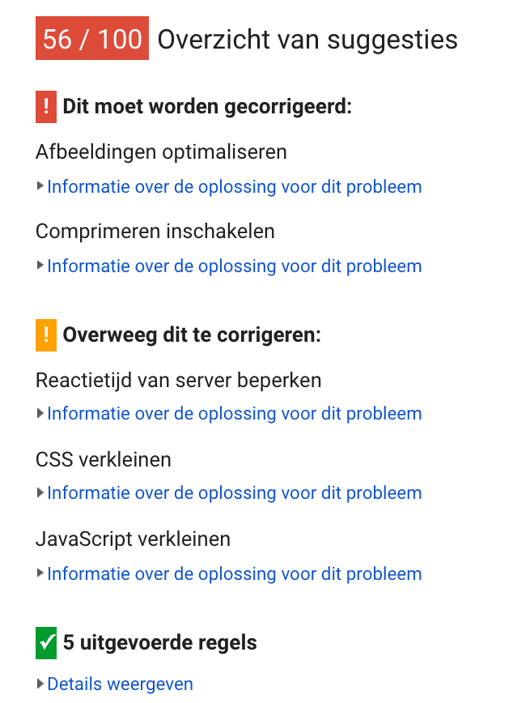

# Performance matters

## Project setup

This project serves an adapted version of the [Bootstrap documentation website](http://getbootstrap.com/). It is based on the [github pages branche of Bootstrap](https://github.com/twbs/bootstrap/tree/gh-pages).

Differences from actual Bootstrap documentation:

- Added custom webfont
- Removed third party scripts
- The src directory is served with [Express](https://expressjs.com/).
- Templating is done with [Nunjucks](https://mozilla.github.io/nunjucks/)

## Getting started

- Install dependencies: `npm install`
- Serve: `npm start`
- Expose localhost: `npm run expose`

## Audit || Before

Here you can see what the site's performance was prior to doing performance stuff.

### Filmstrip

### Chrome DevTools Audit

### PageSpeed Insights

## Audit || FOIT

Next step is to make sure the font will show fallback fonts when our fancy font is not there yet so we don't have an empty page. I will be doing this with [bramstein/fontfaceobserver](https://github.com/bramstein/fontfaceobserver).

### Filmstrip
After introducing this font switch u can see that instead of 9.0s for first text show, we brought it back to 5.5s.

### Chrome DevTools Audit
Has stayed the same.

### PageSpeed Insights
Has stayed the same.

## Audit || loadCSS

Next step is to make the css load async instead.  I will be doing this with [filamentgroup/loadcss](https://github.com/filamentgroup/loadCSS).

### Filmstrip
It seems the html indeed loads on screen way earlier. But the complete render takes way longer.

### Chrome DevTools Audit
Seems pretty much the same.

### PageSpeed Insights
I lost one point...

## Audit || criticalCSS

Next step is to make the above the content above the fold instantly styled.  I will be doing this with [critical css](https://jonassebastianohlsson.com/criticalpathcssgenerator/).

### Filmstrip
This will result in a way faster full render.

### Chrome DevTools Audit
Stayed the same.

### PageSpeed Insights
Gained 11 points :tada:

## Audit || Minify

Next we can compress and minify some files.

### Filmstrip
Pushed back to 3.5s.

### Chrome DevTools Audit
Fixes lots of points here.

### PageSpeed Insights
Gained 23 points :tada:

## Audit || gzip

Next we will add gzip on the server side.

### Filmstrip
the filmstrip stayed pretty much the same.

### Chrome DevTools Audit
gzip note dissapeared.

### PageSpeed Insights
Gained 13 points :tada:

