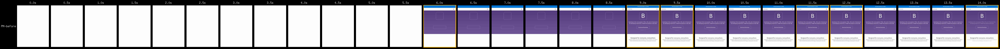
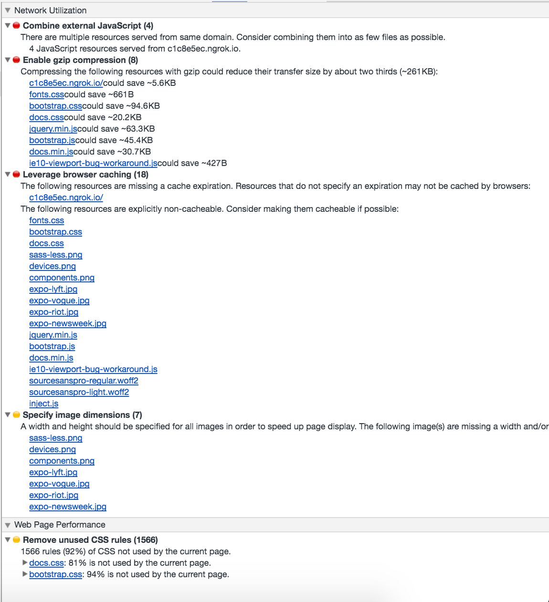
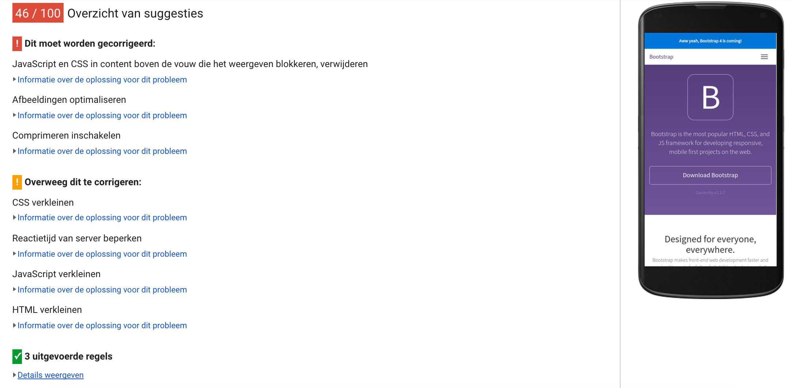
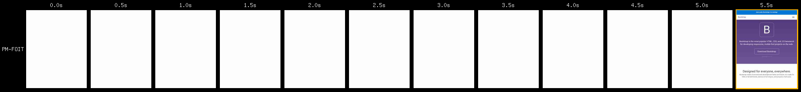

# Performance matters

## Project setup

This project serves an adapted version of the [Bootstrap documentation website](http://getbootstrap.com/). It is based on the [github pages branche of Bootstrap](https://github.com/twbs/bootstrap/tree/gh-pages).

Differences from actual Bootstrap documentation:

- Added custom webfont
- Removed third party scripts
- The src directory is served with [Express](https://expressjs.com/).
- Templating is done with [Nunjucks](https://mozilla.github.io/nunjucks/)

## Getting started

- Install dependencies: `npm install`
- Serve: `npm start`
- Expose localhost: `npm run expose`

## Audit || Before

Here you can see what the site's performance was prior to doing performance stuff.

### Filmstrip

### Chrome DevTools Audit

### PageSpeed Insights

## Audit || FOIT

Next step is to make sure the font will show fallback fonts when our fancy font is not there yet so we don't have an empty page. I will be doing this with [bramstein/fontfaceobserver](https://github.com/bramstein/fontfaceobserver).

### Filmstrip
After introducing this font switch u can see that instead of 9.0s for first text show, we brought it back to 5.5s.

### Chrome DevTools Audit
Has stayed the same.

### PageSpeed Insights
Has stayed the same.
