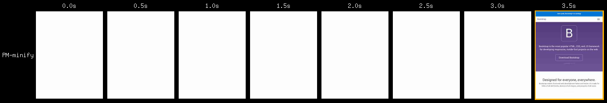
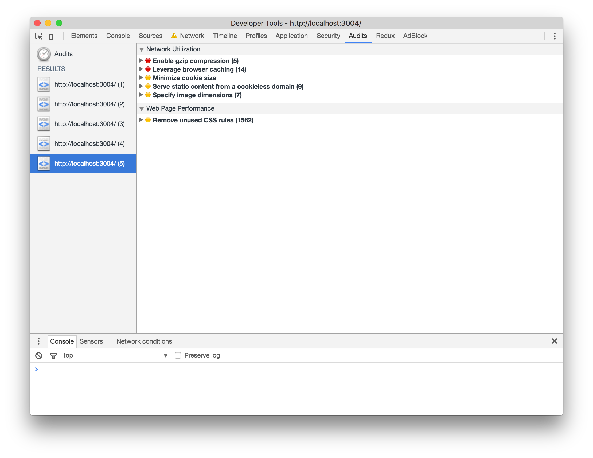
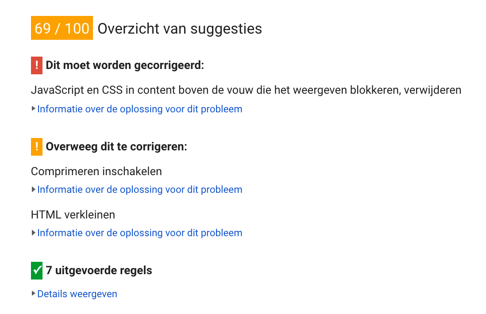

# Performance matters

## Project setup

This project serves an adapted version of the [Bootstrap documentation website](http://getbootstrap.com/). It is based on the [github pages branche of Bootstrap](https://github.com/twbs/bootstrap/tree/gh-pages).

Differences from actual Bootstrap documentation:

- Added custom webfont
- Removed third party scripts
- The src directory is served with [Express](https://expressjs.com/).
- Templating is done with [Nunjucks](https://mozilla.github.io/nunjucks/)

## Getting started

- Install dependencies: `npm install`
- Serve: `npm start`
- Expose localhost: `npm run expose`

## Audit || Before

Here you can see what the site's performance was prior to doing performance stuff.

### Filmstrip

### Chrome DevTools Audit

### PageSpeed Insights

## Audit || Minify

Next we can compress and minify some files.

### Filmstrip
Pushed back to 3.5s.

### Chrome DevTools Audit
Fixes lots of points here.

### PageSpeed Insights
Gained 23 points :tada:

